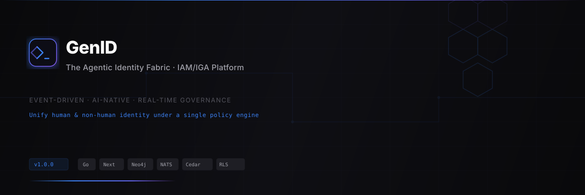
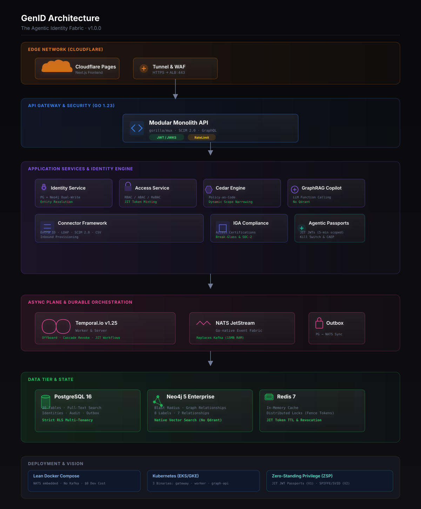

<div align="center">



# GenID · The Agentic Identity Fabric

**A graph-native, policy-as-code Identity & Access Management (IAM / IGA) platform
built for the AI-agent era — securing humans, machines, and autonomous agents in real time.**

[](https://go.dev/)
[](https://nextjs.org/)
[](https://www.postgresql.org/)
[](https://neo4j.com/)
[](https://www.cedarpolicy.com/)
[](https://temporal.io/)
[](https://nats.io/)
[](LICENSE)

[](ARCHITECTURE.md)
[](docs/JOURNEY.md)
[](SECURITY.md)
[](DEPLOYMENT.md)

</div>

---

### For reviewers with limited time

| If you have… | Read this |
|---------------|-----------|
| **30 seconds** | This README's "By the Numbers" + "The Idea" + the architecture diagram below |
| **3 minutes**  | [ARCHITECTURE.md](ARCHITECTURE.md) — code-backed deep dive (every claim links to a file) |
| **15 minutes** | [docs/JOURNEY.md](docs/JOURNEY.md) — the actual engineering story, 6 phases / 98 commits |
| **Security focus** | [SECURITY.md](SECURITY.md) — 12-layer audit + remediation queue |
| **Hands-on** | [DEPLOYMENT.md](DEPLOYMENT.md) — `docker compose up -d` one-shot, Cloudflare Tunnel, Oracle Cloud $0 |

---

### By the numbers

| | |
|---|---:|
| Commits | **98+**, all driven by preparation for FAANG-grade review |
| Go backend | **~31K LOC** (modular monolith) |
| TypeScript frontend | **~7.2K LOC** (Next.js 14, static export) |
| RLS-protected Postgres tables | **28** (56 RLS policies) |
| Identity kill switch (Temporal + Redis JTI) | **~109 ms** |
| Cedar policy files (RBAC / ABAC / Agent / SoD) | **4** |
| Temporal workflows / activities | **11 / 29** |
| JIT non-human-identity sessions | **5-minute scoped JWTs**, zero-standing default |

---

### The idea

Identity is splitting in two. **Humans** still need HR-driven onboarding and attestations. **Agents** —
LLMs, copilots, autonomous workers, service accounts — need **scoped, short-lived, revocable**
authority that disappears the moment the task ends. Existing IAM/IGA tools enforce the first half
poorly and the second half not at all.

GenID is the control plane that closes that gap.
**One policy engine (AWS Cedar) governs both worlds, a Neo4j graph computes blast radius in real
time, and a Temporal-driven kill switch revokes a compromised identity in ~109 ms.**

This is the architecture that Okta, Anthropic, and SpaceX AI are each independently investing in:
- **Okta** → governance of non-human identities and JIT access
- **Anthropic / Claude** → safe agentic authority with real-time revocation
- **SpaceX AI** → deterministic, audit-grade access for autonomous workloads

---

### Architecture — the five planes

> Edge · Gateway · Services · Async · State, built around a **PG + Neo4j dual-write** core and
> an **AWS Cedar** policy engine at the heart of every authorization decision.

<div align="center">

</div>

**1 · Edge** — Cloudflare Tunnel + WAF; Next.js 14 SPA; SCIM 2.0 inbound provisioning.
**2 · Gateway** — Go 1.25 HTTP server, JWT/JWKS, API-Key, per-IP rate limit, WorkflowGuard.
**3 · Services** — Identity · Access · Cedar · NHI · IGA · GraphQL · **GraphRAG AI Copilot**.
**4 · Async** — Temporal v1.25 (kill switch workflows) · NATS JetStream · transactional outbox.
**5 · State** — PostgreSQL 16 (RLS), Neo4j 5 (identity graph), Redis 7 (JTI revocation + locks).

> 💡 Full code-backed breakdown in **[ARCHITECTURE.md](ARCHITECTURE.md)** — including the
> real GraphRAG pipeline and exactly where Qdrant slots in for hybrid retrieval at scale.

---

### What I actually built — and what it proves

This is not tutorial code. Each capability below is verifiable in the repo today:

- **🛡️ 109ms Kill Switch** — Risk-tiered revocation via Temporal signal + Redis JTI blocklist. *→ `backend/internal/workflow/workflows.go`*
- **📜 Continuous Authorization (AWS Cedar)** — Policy-as-code with hot-reload; compiled policies persisted in `cedar_policies.cedar_text`. *→ `backend/internal/cedar/engine.go`, `policies/*.cedar`*
- **🤖 Non-Human Identity (NHI) governance** — First-class NHI registry, agent-scoped Cedar policies, 5-min scoped JIT JWTs. *→ `policies/agent.cedar`, `backend/internal/service/identity_service.go`*
- **🕸️ Graph-Native Analytics** — Real-time Blast Radius & Separation-of-Duties via Neo4j variable-length Cypher. *→ `backend/internal/service/identity_service.go`*
- **🧠 GraphRAG AI Copilot** — Real retrieval-augmented pipeline: classify → Cypher retrieve → Cedar-policy context → rerank → generate → validate. *→ `backend/internal/ai/copilot.go`*
- **🔗 Tamper-Proof Audit Ledger** — SHA-256 chained hashes detect rogue-admin tampering. *→ `backend/internal/audit/chain.go`*
- **🔐 Strict Multi-Tenancy** — RLS enforced at the database layer across 28 tables (not in app code). *→ `infrastructure/postgres/init.sql`*
- **📡 Event-Driven Core** — Transactional-outbox + NATS JetStream (replaces Kafka at ~15MB RAM). *→ `backend/internal/outbox/`*
- **🔌 Manifest-Driven Connectors** — Entra ID · LDAP · SCIM 2.0 · CSV · generic REST, all defined declaratively. *→ `backend/internal/connector/`*

---

### Tech stack

| Category | Technology |
|----------|------------|
| **Backend** | Go 1.25 · gorilla/mux · pgx/v5 · neo4j-go-driver · Temporal SDK |
| **Frontend** | Next.js 14 · React 18 · Tailwind CSS · static export |
| **Data**    | PostgreSQL 16 (RLS) · Neo4j 5 · Redis 7 |
| **Async**   | Temporal v1.25 · NATS JetStream · transactional outbox |
| **Policy**  | AWS Cedar (policy-as-code, hot-reload) |
| **AI**      | GraphRAG copilot (Neo4j retrieval + Cedar context) · Qdrant slot for hybrid |
| **Infra**   | Docker Compose · Cloudflare Tunnel · Prometheus / OTLP |

---

### Quickstart

```bash
git clone https://github.com/ShoaibsProjects/GenID.git
cd GenID

# 1 · Bring up the stack (PG · Neo4j · Redis · Temporal · NATS)
cd infrastructure && docker compose up -d

# 2 · Run the backend (Go API gateway + in-process Temporal worker)
cd ../backend && cp .env.example .env && go run cmd/identity-service/main.go

# 3 · Run the frontend (Next.js 14)
cd ../frontend && npm install && npm run dev
```

API → `http://localhost:8080` · UI → `http://localhost:3001`

For hardened / Oracle Cloud / Cloudflare Tunnel deployment: **[DEPLOYMENT.md](DEPLOYMENT.md)**.

---

### Repository map

```
backend/
  cmd/identity-service/        Go entry; in-process Temporal worker
  internal/                    ai · cedar · service · workflow · activities ·
                               connector · vault · audit · oidc · outbox · risk · middleware
  policies/*.cedar             AWS Cedar policy-as-code (rbac, abac, agent, sod)
infrastructure/
  postgres/init.sql            28 tables · 56 RLS policies · audit chain
  docker-compose.yml           hardened stack (binds to 127.0.0.1)
frontend/src/app/              dashboard · identities · agents · connectors · access · audit · vault · idp
ARCHITECTURE.md                code-backed technical reference (this README's big sibling)
docs/JOURNEY.md                the engineering story — 6 phases, 98 commits
SECURITY.md                    12-layer FAANG-grade audit + remediation queue
CONTRIBUTING.md                standards, workflow, review checklist
DEPLOYMENT.md                  one-shot deploy on Oracle Cloud + Cloudflare Tunnel
```

---

<div align="center">
<sub>Built with determination by <a href="https://github.com/ShoaibsProjects">Shoaib Akthar</a> · GenID © 2026 · MIT License</sub>
</div>
